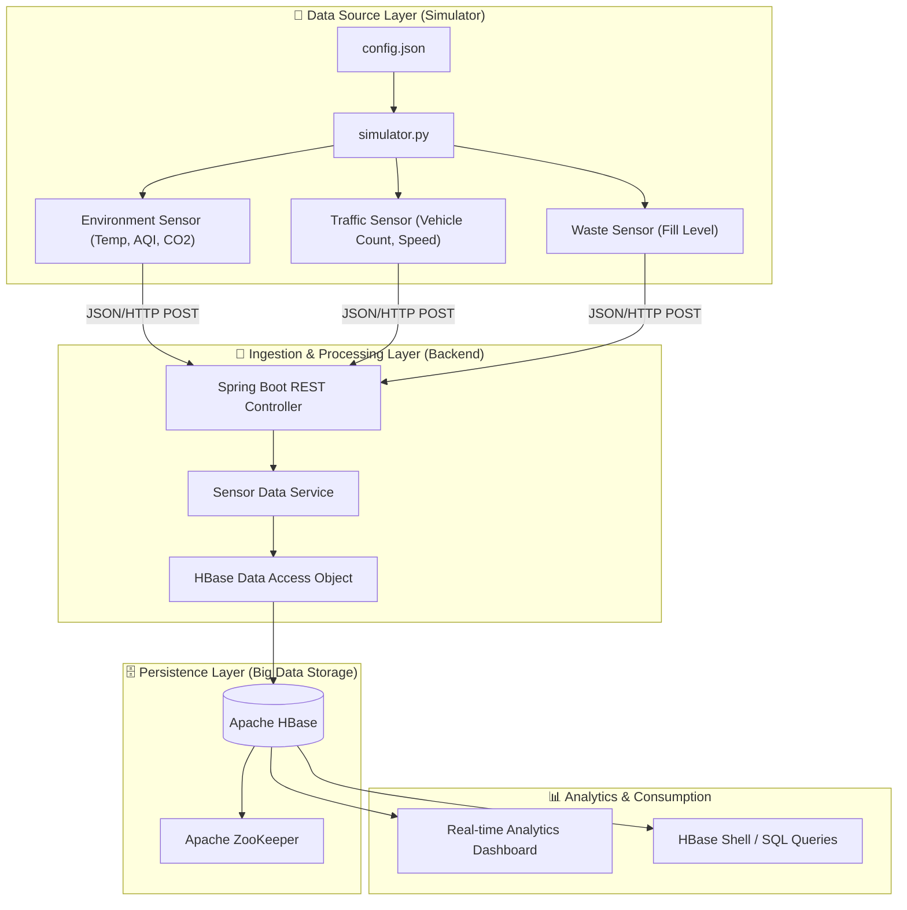

# 🌆 SmartCityHbase: Distributed Smart City Monitoring System

**SmartCityHbase** is a comprehensive distributed system project designed for real-time monitoring and analysis of urban environments. The system leverages a high-performance **Python-based Sensor Simulator** to generate telemetry data and a robust **Spring Boot Backend** to ingest, process, and persist this data into **Apache HBase**, a distributed, scalable NoSQL database.

---

## 🏗️ System Architecture

The project is built on a scalable, modular architecture that separates data generation from storage and processing.



---

## ⚙️ Project Tech Stack

- **Simulator**: Python 3.x, `requests`, `random`, `json` (ISO 8601 Compliance).
- **Backend**: Java 17, Spring Boot 3.5.x, Maven.
- **Storage**: Apache HBase 2.5.6 (NoSQL), Apache ZooKeeper.
- **Data Protocol**: RESTful JSON over HTTP.

---

## 🔄 End-to-End Workflow

### 1. Data Generation (The Simulator)
- The simulator initializes sensors based on the `config.json` file.
- It uses **Abstract Base Classes (ABC)** to ensure a consistent data schema across different sensor types (Environment, Traffic, Waste).
- Telemetry is generated at configurable intervals and transmitted via **HTTP POST** requests to the backend.

### 2. Data Ingestion (The Spring Boot API)
- The backend exposes a `/insert` endpoint that accepts sensor telemetry in JSON format.
- Spring Boot's **REST Controller** validates the incoming payload.
- The **Sensor Data Service** layers the business logic, mapping the JSON fields to HBase column families and qualifiers.

### 3. Distributed Storage (Apache HBase)
- Data is persisted into **HBase Tables**.
- The schema is designed for high-frequency writes and efficient range scans using timestamps.
- **HBase Client API** is used to manage row keys (typically `sensorId + timestamp`) for optimal data distribution across the cluster.

### 4. Monitoring & Verification
- Users can verify the data flow through backend logs.
- Direct database verification can be performed using the **HBase Shell**:
  ```bash
  scan 'smart_city_telemetry'
  ```

---

## 🚀 Getting Started

### Prerequisites
- Docker (for HBase/ZooKeeper local setup)
- Java 17+ and Maven
- Python 3.8+

### Setup Instructions
1. **Fire up the Backend**:
   ```bash
   cd backend
   mvn spring-boot:run
   ```
2. **Launch the Simulator**:
   ```bash
   cd Simulator
   pip install -r requirements.txt
   python simulator.py
   ```

---
*Empowering future cities with distributed intelligence.*
